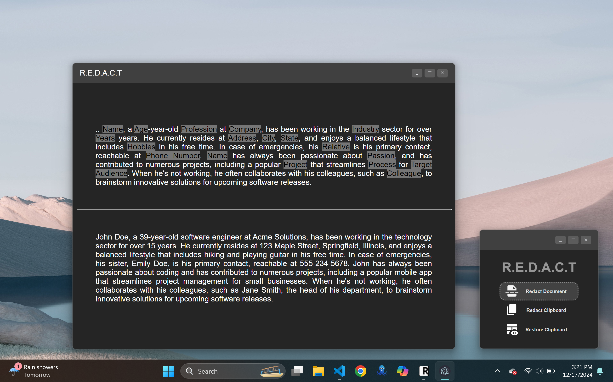

# R.E.D.A.C.T

**R.E.D.A.C.T** (Restricting Exposed Data by Anonymization for Confidential Transmission) is an Electron-based application that helps you redact personal information from text documents and clipboard content. It also allows you to restore the original content from redacted text using a predefined mapping.

## Features

- Intuitive UI for redacting personal information from text documents and the clipboard
- Quick editing of redacted text
- Simple restoration of original content
- Drag-and-drop support for easy file import
- Popup notifications for user alerts
- Generate redacted clones of PDF and TXT files by appending `-REDACTED` to the filename

## Preview



### Installation

1. **Clone the repository**:  
   ```sh
   git clone https://github.com/abhishekk962/redact.git
   cd redact
   ```

2. **Install dependencies**:
   ```sh
   npm install
   ```

3. **Install LM Studio v0.3.5**:  
   [Download here](https://releases.lmstudio.ai/linux/x86/0.3.5/beta/9h/LM_Studio-0.3.5.AppImage).  
   *(Use v0.3.5 for QNN model compatibility. Future versions may not support it.)*

4. **Download Llama 3.2 3B Model**:
   - **Beta access**: Download Llama 3.2 3B QNN to the model directory.  
   - **No beta access**: Download Llama 3.2 3B Instruct from the LM Studio interface.

5. **Update the configuration**:  
    In LM Studio, locate the `indexedModelIdentifier` in the model details. Copy it and update the `modelPath` in [config.json](src/config.json).

6. **Start the application**:  
   *(Ensure LM Studio is running. For headless mode, enable Local LLM Service in LM Studio settings.)*  
   ```sh
   npm start
   ```

## Usage

### Redact Clipboard Content
Click the "Redact Clipboard" button to redact personal information from the clipboard content.  
The redacted content will be displayed in a new window.

### Restore Clipboard Content
Click the "Restore Clipboard" button to restore the original content from the redacted text in the clipboard.  
The restored content will be displayed in a new window.

### Redact Document
Drag and drop a text or PDF document onto the "Redact Document" section. The application will display the redacted content in a new window and automatically save it as a text file with the "-REDACTED" suffix.

### Edit Redacted Content
Click on any redacted word on the output window to restore it if you wish to make edits.

## Note on Accuracy
The app may fail to detect all PII in the clipboard/document and may not redact everything properly, because it uses a smaller model. Exercise caution.

## Examples
The [examples/](examples/) folder includes sample input and output files to demonstrate the redaction process:
- **example_data.txt** – Contains mock personal information for testing text redactions.
- **example_data.txt-REDACTED.txt** – Shows how the original text file is transformed after redaction.
- **example_data.pdf** – A short PDF showcasing PDF redaction.
- **example_data.pdf-REDACTED.txt** – Demonstrates how a redacted PDF is converted into a text file with personal information removed.

Feel free to experiment with these files to see how the app detects and redacts sensitive data.

## License
[MIT License](LICENSE)

